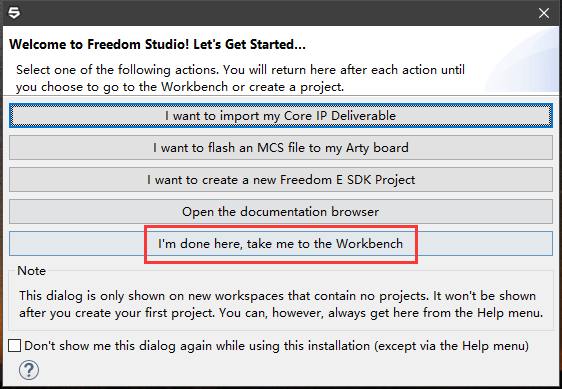
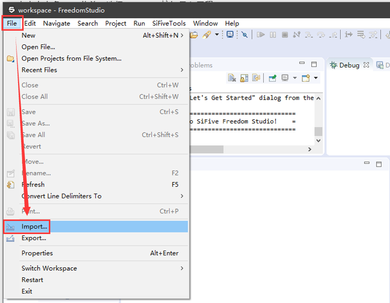
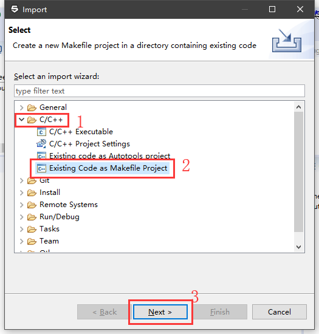
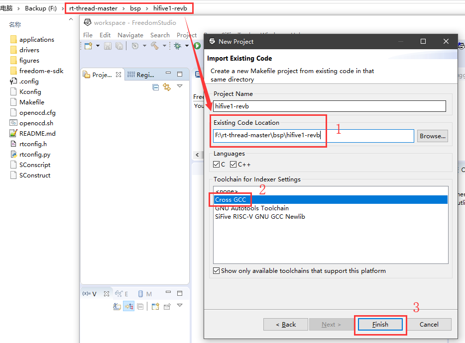
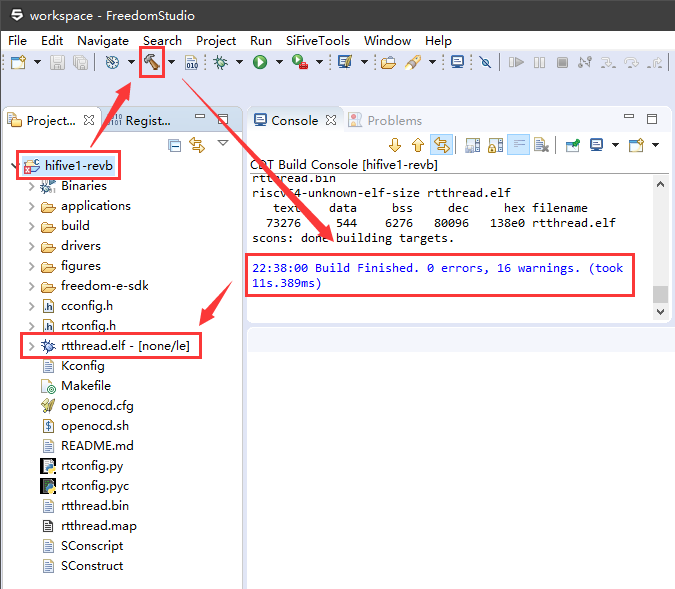
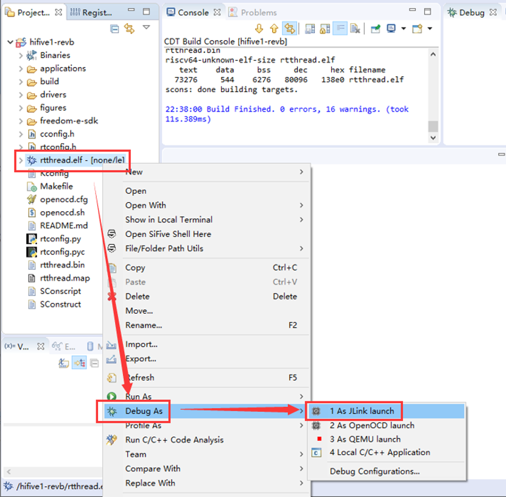
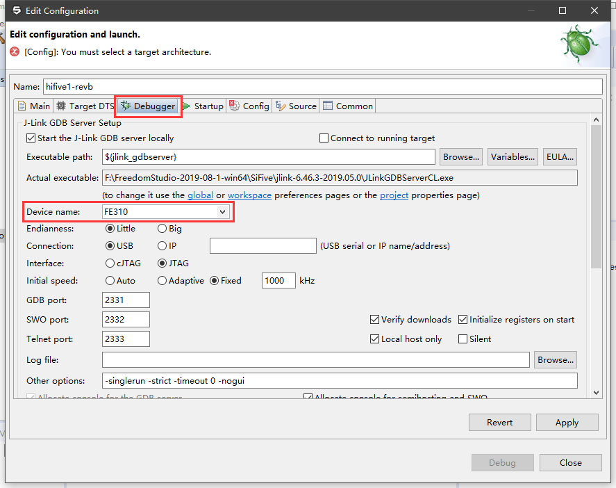
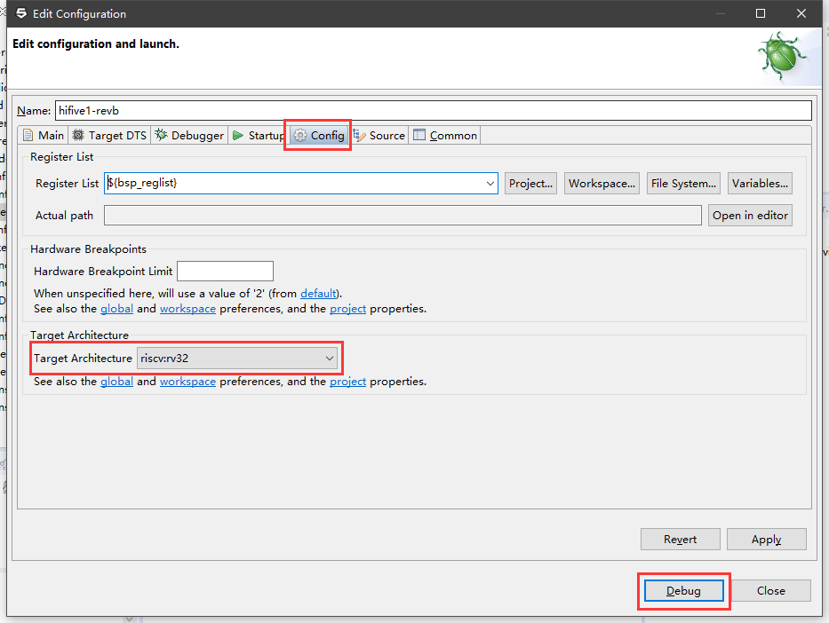
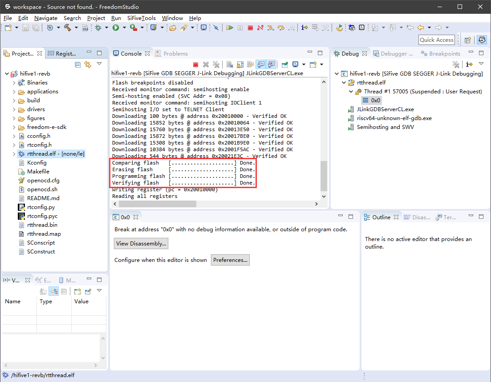

# HiFive1 Rev B #

## 简介

[HiFive1 Rev B](https://www.sifive.com/boards/hifive1-rev-b) 是一款基于FE310 SoC的低成本开发板的升级版本。


### 板载资源：

| 硬件 | 描述 |
| -- | -- |
|Soc| SiFive Freedom E310 (FE310) |
| 内核    | SiFive E31 RISC-V Core                                      |
| 架构       |  32-bit RV32IMAC                                         |
| 主频       | 320+ MHz                                              |
| 性能 | 1.61 DMIPs/MHz, 2.73 Coremark/MHz            |
|SRAM| 16KB |
|Flash| 32 Mbit Off-Chip (ISSI SPI Flash) |

## 编译说明

### 下载所需工具及源码

Freedom Studio 是 SiFive 公司推出的一个集成开发环境，用来编写和调试基于 SiFive 处理器的软件。内嵌了编译好的 RISC-V GCC 工具链、OpenOCD、以及一些示例和文档。

Freedom Studio
下载地址：[官网下载](https://www.sifive.com/boards/)

RT-Thread Env工具
下载地址：[官网下载](https://www.rt-thread.org/page/download.html)

RT-Thread 源码
下载地址：[Github下载](https://github.com/RT-Thread/rt-thread)

HiFive1 Rev B bsp文件
下载地址：[Github下载](https://github.com/KatyushaScarlet/hifive1-revb)


将 Freedom Studio 与 Env 工具解压到非中文字符且不含空格的目录下


打开 `FreedomStudio-2019-08-1-win64\SiFive\Drivers` 文件夹，安装驱动文件


如图下所示，将 HiFive1 Rev B bsp 文件放置在 RT-Thread 源码中的 bsp 文件夹内


### 配置工具链

工具链默认位置为 `F:\FreedomStudio-2019-08-1-win64\SiFive\riscv64-unknown-elf-gcc-8.3.0-2019.08.0\bin` 目录下

运行 env 工具，根据实际情况，输入以下命令设置环境变量：

```
set RTT_EXEC_PATH=工具链的路径
set path=%path%;工具链的路径
```

例如：

```
set RTT_EXEC_PATH=F:\FreedomStudio-2019-08-1-win64\SiFive\riscv64-unknown-elf-gcc-8.3.0-2019.08.0\bin
set path=%path%; F:\FreedomStudio-2019-08-1-win64\SiFive\riscv64-unknown-elf-gcc-8.3.0-2019.08.0\bin
```


### 从 env 工具打开 IDE

利用 cd 命令，切换到 FreedomStudio 解压后的目录中，再执行 `FreedomStudio.exe` 文件运行IDE


在弹出的窗口输入 workspace 创建工作空间，然后点击 Launch 启动 IDE


点击 `I’m done here, take me to the Workbench` 进入 IDE 主窗口



### 导入工程

点击菜单栏左上角 `File->Import...` 



展开 `C/C++` ，选择 `Existing Code as Makefile Project` ，点击 Next 继续



在编辑框中填入 bsp 文件所在目录，选择 `Cross GCC` ，点击 Finish 导入



### 编译

选中要编译的工程，点击左上角的锤子图标开始编译

当窗口输出 `Build Finished` ，左侧文件列表出现 `rtthread.elf` 文件时，即为编译成功



## 烧写及执行

### 配置 Debug 参数

使用 Micro USB 数据线连接电脑与开发板

右键列表中的 `rtthread.elf` 文件，选择 `Debug As->1 As JLink launch`



点击 Debugger 选项卡，选择设备名称 `FE310` 



点击 Startup 选项卡，根据图中选项进行设置


点击 Config 选项卡，在 'Target Architecture' 处选择 'riscv:cv32' ，点击 Debug 开始调试




### 运行结果

下载程序之后，连接串口(115200-N-8-1)，可以看到 RT-Thread 的输出信息：

```
 \ | /
- RT -     Thread Operating System
 / | \     4.0.2 build Oct 11 2019
 2006 - 2019 Copyright by rt-thread team
 msh >
```

按下Tab键可以查看 RT-Thread 内置的命令

```
msh >
RT-Thread shell commands:
memcheck         - check memory data
memtrace         - dump memory trace information
version          - show RT-Thread version information
list_thread      - list thread
list_sem         - list semaphore in system
list_event       - list event in system
list_mutex       - list mutex in system
list_mailbox     - list mail box in system
list_msgqueue    - list message queue in system
list_mempool     - list memory pool in system
list_timer       - list timer in system
list_device      - list device in system
help             - RT-Thread shell help.
ps               - List threads in the system.
free             - Show the memory usage in the system.

msh >
```

## 4. 驱动支持情况及计划

| 驱动 | 支持情况  |  备注  |
| ------ | ----  | :------:  |
| UART | 支持 | UART0_RX/TX：GPIO 16/17 |


### 4.1 IO在板级支持包中的映射情况

| IO号 | 板级包中的定义 |
| -- | -- |
| GPIO19 | LED_GREEN |
| GPIO21 | LED_BLUE |
| GPIO22 | LED_RED |

## 5. 联系人信息

维护人：
- [tanek](https://github.com/TanekLiang)
- [Katyusha](https://github.com/KatyushaScarlet)

## 6. 参考

* [HiFive1 Rev B](https://www.sifive.com/boards/hifive1-rev-b/)
* [Boards & Software - SiFive](https://www.sifive.com/products/tools/)
* [HiFive1 Rev B Getting Started Guide](https://sifive.cdn.prismic.io/sifive%2F4f5a7851-1b52-463b-a293-f352036bc809_hifive1b-getting-started-guide_v1.1.pdf)
* [HiFive1 Rev B Schematics](https://sifive.cdn.prismic.io/sifive%2Fa4546ced-0922-4d87-9334-e97c1a9fd9a5_hifive1.b01.schematics.pdf)
